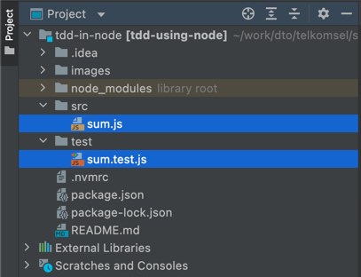

## Prerequisites

- Tested with nodejs 16 on mac-os

## Running

Install npm dependencies first by running `npm install`

Check you have the setup working by running `npm run test` in your terminal on mac-os. You should get something like

Then, you can check the appropriate source files and write tests

